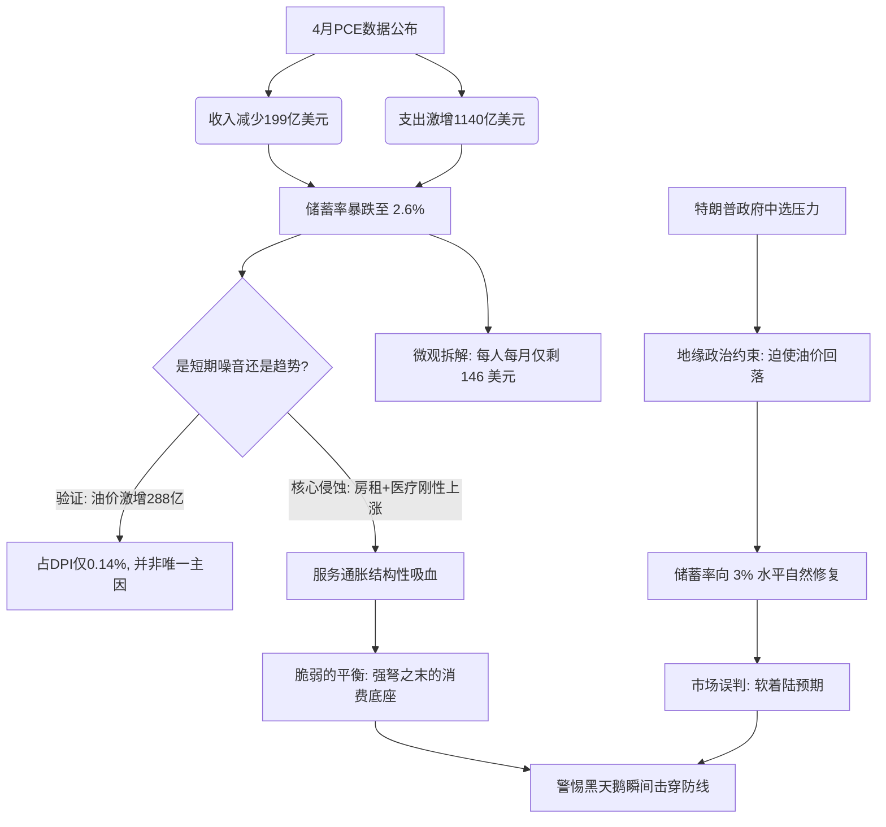

# 宏观推演研判日志：2026年4月PCE报告与“脆弱的3%”消费底座

> **研判基准：** 美国经济分析局 (BEA) 2026年4月个人收入与支出报告  
> **核心议题：** 通胀粘性、储蓄率暴跌的真实结构，以及地缘政治约束下的消费基本面推演。

---

## 🧭 认知投资分析框架：推演全景图

---

## 第一阶段：基准数据的宏观拆解与异常识别

### 1. 初始现象确认：收支的剧烈背离
4月份PCE报告展现出宏观基本面的显著背离。
* **收入侧收缩：** 扣除税收后的实际可支配个人收入（DPI）减少了 **199亿美元**。
* **支出侧激增：** 个人总支出（涵盖PCE及利息等）大幅激增 **1140亿美元**。

### 2. 异常信号捕捉：储蓄底座的坍塌
这种“收入降、支出增”的双向挤压，导致4月份美国**个人储蓄率暴跌至 2.6%**，个人储蓄总额的年化绝对值仅剩 **6117亿美元**。

### 3. 历史坐标系锚定
* **2.6%** 的储蓄率已彻底跌破了 **5% - 8%** 的健康中枢。
* 这一数据正快速逼近 **2005年次贷危机前夕（1.4%）** 的历史极端低位，系统性风险的警报已经拉响。

---

## 第二阶段：认知深潜与微观颗粒度还原

### 1. 底层机制拆解（储蓄率公式）
储蓄率的测算并非简单的“收入除支出”，而是通过以下公式计算：
$$\text{个人储蓄率} = \frac{\text{可支配个人收入 (DPI)} - \text{个人消费支出 (PCE)} - \text{个人利息及非营利转移支付}}{\text{可支配个人收入 (DPI)}}$$

当核心刚性支出（如房贷/房租利息、信贷利息）居高不下时，即使名义消费支出不增加，储蓄率也会被动稀释。

### 2. 人口基数分摊（微观现金流透视）
为了看清虚假繁荣下的真相，我们将宏观数据拉低至微观颗粒度：
* **年化储蓄总额：** 6117亿美元
* **全美人口基数：** 约 3.49 亿人
* **人均月盈余：** 
  $$\frac{6117 \text{ 亿美元}}{3.49 \text{ 亿人} \times 12 \text{ 个月}} \approx 146 \text{ 美元}$$

> [!WARNING]
> **微观透视结论：**  
> 平均每个美国人每月的实际盈余资金仅约 **146美元**。这揭示了在整体“消费强劲”的宏观叙事下，微观家庭现金流已极度枯竭，陷入高度依赖信贷轮转的“走钢丝”状态。

---

## 第三阶段：核心质疑与逻辑推演

### 💡 您的关键质疑（噪音 vs. 趋势）
> *思考路径：* 储蓄率的暴跌是否仅仅是一个短期噪音？考虑到4月份“汽油及其他能源商品”支出激增288亿美元，油价这单个月的额外支出占比是否过大？一旦油价恢复，储蓄率是否会自然反弹，从而证伪“消费枯竭”的危机论调？

### 📊 数据验证与反馈
1. **能源支出的宏观占比：**  
   经测算，新增的 288 亿美元能源支出仅占整体年化可支配收入盘子的 **0.14%** 左右。
2. **结构性侵蚀的真相：**  
   虽然油价是压低单月储蓄率的最大单一增量噪音，但并非全部原因。
   * **“住房与公用事业”** 增加 **227亿美元**
   * **“医疗保健”** 增加 **81亿美元**
   
   这些核心服务支出的刚性上涨，构成了更具破坏性的结构性侵蚀。

---

## 第四阶段：引入地缘政治变量与最终共识达成

### 💡 您的进阶逻辑（政治周期约束）
> *思考路径：* 必须将美国大选周期纳入定价模型。特朗普政府面临中期选举压力，绝不可能容忍美伊冲突长期化并持续推高国内通胀。因此，油价的快速回调是高度确定的短期事件。
> 
> *推演结论：* 储蓄率不会在2.6%的位置直接崩溃，油价回落将为其“输血”，使其回升至3%左右的相对位置。

### 🤝 最终研判共识（脆弱的平衡）

#### 1. 政治干预下的短期修复
中期选举的政治刚性约束将迫使能源价格降温，剔除掉短期噪音后，未来一两个季度内的储蓄率大概率会向 **3%** 左右的水平自然修复。

#### 2. 危机四伏的底座
**3%** 的储蓄率虽然避免了经济基本面的立刻断崖，但依然是一个极度脆弱的低位。它掩盖了深层的贫富分化，且无力抵抗“房租 + 医疗”等刚性服务通胀的长期吸血。

#### 3. 市场定价错位预警
> [!IMPORTANT]
> **警惕温水煮青蛙**  
> 市场极易将“油价回落带动储蓄率重回3%”误判为经济的全面软着陆。但实质上，美国消费引擎依然处于缺乏真实收入支撑、高负债低容错率的“强弩之末”状态。任何超预期的黑天鹅事件，都可能瞬间击穿这层脆弱的防线。
